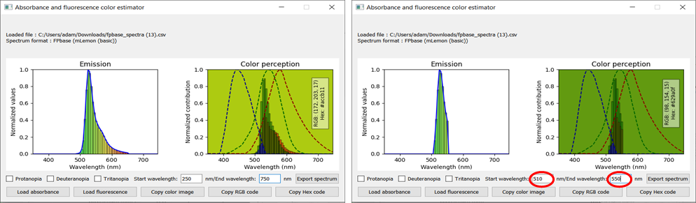
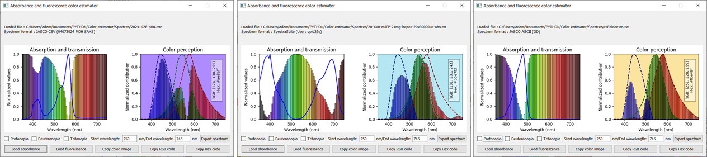
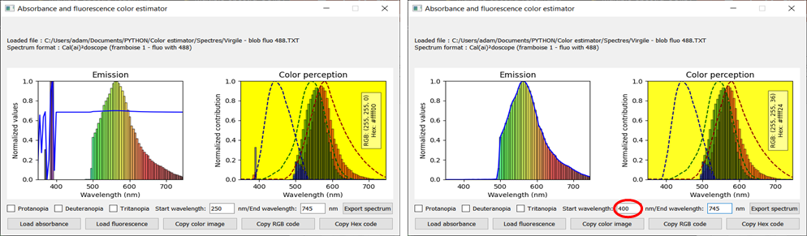

# Absorbance and Fluorescence Color Estimator

[](https://opensource.org/licenses/MIT)

## Overview

`Color_estimator.py` is a Python-based program for analyzing and visualizing absorbance and fluorescence spectra while estimating the resulting perceived color under sunlight. This tool integrates spectral data with cone sensitivity to provide insights into how humans perceive colors.

### Supported Spectrum Formats
The program supports both **absorbance** and **fluorescence** spectra in the following formats:
- **FPbase** (absorbance/excitation and emission spectra)
- **JASCO ASCII**
- **JASCO CSV**
- **SpectraSuite**
- **Cal(ai)²doscope**
- **Generic**: Tab-separated, comma-separated, or space-separated values

---

### Key Features

#### Spectrum Analysis
- **File Formats**: Load both absorbance and fluorescence spectra from multiple formats (e.g., FPbase, JASCO).
- **Normalization**:
  - Automatically fills missing data up to 750 nm with zeros if the last recorded value is below 750 nm and close to 0.
  - Normalizes data between 0 and 1 within the 380-750 nm visible range.

#### Visualization: Left Panel
The left panel displays:
- **Transmission spectrum** (1-normalized absorbance) or **emission spectrum** as bars.
- Bars are binned by 5-nm steps and color-coded by the corresponding wavelengths.
- The normalized absorbance or emission spectrum is overlaid as a line.
- Data is represented between 380 nm and 745 nm.

#### Visualization: Right Panel
The right panel shows:
- The **cone sensitivity curves** (S-cone, M-cone, L-cone).
- The integrated area under the curve for each cone, calculated from the transmission or emission spectrum.
- The fraction of the area relative to the total surface below each cone curve is converted into an **RGB value** (0-255).
- A **final perceived color** is calculated, adjusted by weighting factors, and displayed as the background of the panel.
- The corresponding **RGB** and **Hexadecimal codes** are shown.

---

### Interactive Features

#### Color Vision Deficiency Simulation
The program can simulate the resulting perceived color for individuals with **color blindness**:
- **Protanopia**: L-cone disabled.
- **Deuteranopia**: M-cone disabled.
- **Tritanopia**: S-cone disabled.

Users can enable these simulations dynamically via checkboxes.


---

#### Artifact Removal and Wavelength Restriction
- Users can restrict the wavelength range to remove artifacts (e.g., laser lines or bad normalization).
- The spectrum automatically updates when the **start** or **end wavelength** fields are modified.



---

#### Multi-Spectrum File Support
- When loading a file with multiple spectra (e.g., FPbase files), a **drop-down menu** allows users to select the spectrum to display.
- If no absorbance spectrum is found in the file, the excitation spectrum is used instead. A warning message is displayed to inform users of the potential inaccuracy of the resulting color.


---

#### Export and Copy Options
- **Spectrum Export**: Save the processed, normalized (5-nm binned) spectrum in ASCII format.
- **Color Export**:
  - Copy the **color image** (as a square patch) to the clipboard.
  - Copy the **RGB code** or **Hexadecimal code** to the clipboard.


---

### Installation and Requirements

#### Clone the Repository
To get started, clone this repository:
```bash
git clone https://github.com/VirgileAdam/Color_estimator.git
cd Color_estimator
```

---

#### Run the Program
`Color_estimator.py` automatically installs any missing dependencies. Simply run the program using Python 3.6 or later:
```bash
python Color_estimator.py
```

---

#### File Requirements
Ensure the following files are in the same directory as `Color_estimator.py`:
- `Red.csv`: Sensitivity curve for L-cones (red)
- `Green.csv`: Sensitivity curve for M-cones (green)
- `Blue.csv`: Sensitivity curve for S-cones (blue)

---

### Examples and Screenshots

#### Default Interface
The main interface at launch displays buttons to load absorbance or fluorescence spectra:


---

#### Absorbance Spectrum Visualization
Three examples of absorbance spectra loaded in JASCO ASCII, JASCO CSV, and SpectraSuite formats:



---

#### Fluorescence Spectrum Visualization
Three examples of fluorescence spectra loaded in FPbase, FPbase (with multiple spectra), and Generic formats:


---

#### Artifact Removal
Remove unwanted artifacts (e.g., noise or laser lines) by restricting the wavelength range:



---

#### Color Changes for Variable States
Examples of color change for a sample in absorbance (rsFolder on/off) and fluorescence (Dendra2 Green/Red):


---

#### Comparison with Missing Data
If no absorbance data is found in a file, excitation data is used instead, with a warning message:


---

### Contact

This program was developed by **Virgile Adam**, based at the [Institut de Biologie Structurale (IBS)](https://www.ibs.fr/), Grenoble, France.

- **Email**: [virgile.adam@ibs.fr](mailto:virgile.adam@ibs.fr)
- **Personal website**: [www.virgile-adam.com](http://www.virgile-adam.com)
- **Research team**: [Pixel Team](https://www.ibs.fr/en/research/assembly-dynamics-and-reactivity/integrated-imaging-of-stress-response-group/pixel-team/)

Feel free to reach out for inquiries, collaborations, or feedback.
